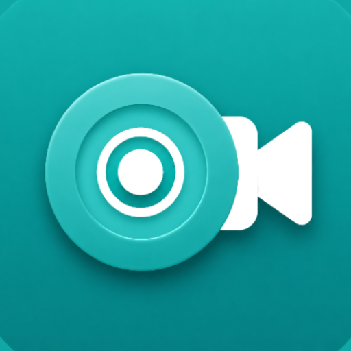

<div align="center">

  

# ScreenX

**Pure, powerful screen recording for Android. No limits, no nonsense.**

  <p>
    <a href="https://github.com/gtxprime/screen-x/stargazers">
      
    </a>
    <a href="https://github.com/gtxprime/screen-x/network/members">
      
    </a>
    <a href="https://github.com/gtxprime/screen-x/issues">
      
    </a>
    <a href="https://github.com/gtxprime/screen-x/blob/main/LICENSE">
      
    </a>
    <a href="#">
      
    </a>
    <a href="https://github.com/gtxprime/screen-x/releases/latest">
      
    </a>
  </p>

  <a href="https://github.com/gtxprime/screen-x/releases/latest">
    
  </a>

  <h3>
    <a href="#-features">Features</a>
    <span> | </span>
    <a href="#-tech-stack">Tech Stack</a>
    <span> | </span>
    <a href="#-project-structure">Project Structure</a>
    <span> | </span>
    <a href="#-installation">Installation</a>
    <span> | </span>
    <a href="#-contributing">Contributing</a>
  </h3>

</div>

---

## 📱 About ScreenX

> [!NOTE]
> **ScreenX** is a modern, high-performance screen recording utility built for Android. It prioritizes smooth performance, minimal system overhead, and useful productivity features like live annotations and floating overlays. Whether you're recording gameplay, creating app walkthroughs, or capturing bug reports, ScreenX handles it with style.

---

## <a id="-features"></a>🚀 Core Features

<table width="100%">
  <tr>
    <td width="50%" valign="top">
      <h3>🎥 High-Fidelity Recording</h3>
      <p>Configure video output exactly to your device and storage needs.</p>
      <ul>
        <li><b>Custom Configurations:</b> Adjust resolution (up to 1080p+), frame rates (30/60 FPS), and bitrates.</li>
        <li><b>Format Control:</b> Output <code>.mp4</code> video files using hardware-accelerated MediaCodec API.</li>
        <li><b>Dynamic Orientation:</b> Adapts recording orientation automatically based on device state.</li>
      </ul>
    </td>
    <td width="50%" valign="top">
      <h3>🎙️ Capture Options</h3>
      <p>Clean sound options for any recording context.</p>
      <ul>
        <li><b>Audio Sources:</b> Record external microphone audio or internal system audio (Android 10+).</li>
        <li><b>Custom Quality:</b> Configure sample rates and audio bitrates for crystal-clear sound.</li>
      </ul>
    </td>
  </tr>
  <tr>
    <td width="50%" valign="top">
      <h3>🖌️ Live Annotations & Brush</h3>
      <p>Annotate your screen on-the-fly while recording is active.</p>
      <ul>
        <li><b>Draw on Screen:</b> Canvas overlay lets you draw directly on top of active apps.</li>
        <li><b>Custom Styling:</b> Choose brush colors dynamically and adjust brush size.</li>
        <li><b>Quick Actions:</b> Erase strokes or clear the canvas instantly.</li>
      </ul>
    </td>
    <td width="50%" valign="top">
      <h3>🎛️ Floating Control Panel</h3>
      <p>Non-intrusive widget for quick, easy management.</p>
      <ul>
        <li><b>Quick Access:</b> Expanded controls for record, pause, stop, and brush tools.</li>
        <li><b>Smart Snapping:</b> Drag-and-drop widget snaps to screen edges and saves position.</li>
        <li><b>Auto-Hide:</b> Fades/hides during inactivity or user interaction.</li>
      </ul>
    </td>
  </tr>
  <tr>
    <td colspan="2" valign="top">
      <h3>⚡ Quick Settings Tile Integration</h3>
      <p>Start recording in a single tap without opening the main app interface.</p>
      <ul>
        <li><b>One-Tap Recording:</b> Instantly initiate or stop recordings directly from Android Quick Settings.</li>
        <li><b>Background Launching:</b> Handles foreground service and media projection requests seamlessly.</li>
      </ul>
    </td>
  </tr>
</table>

---

## 🛠️ Tech Stack & Architecture

ScreenX is designed with modern Android development practices, ensuring scalability, performance, and clean code division:

* **Language:** 100% Kotlin
* **UI Framework:** Jetpack Compose with Material Design 3 (Material You dynamic theme support)
* **Background Tasks:** Android Foreground Services (`ScreenRecordService`) with high-priority Notification channels
* **Media Pipelines:** MediaProjection API, MediaRecorder, and custom AudioPlaybackCapture configurations
* **State Management:** Kotlin Coroutines and Flows for reactive settings management
* **Data Layer:** Jetpack DataStore / SharedPreferences for storing user configurations

---

## 📂 Project Structure

```
screen-x
│
├── app/src/main/java/com/gxdevs/screenx/
│   ├── data/
│   │   └── SettingsManager.kt       # Manages recording and UI settings
│   │
│   ├── service/
│   │   ├── ScreenRecordService.kt   # Core background recording service
│   │   ├── AudioCaptureHelper.kt    # Logic for internal / microphone audio capture
│   │   ├── FloatingControlOverlay.kt # Draggable overlay control panel
│   │   ├── BrushDrawingOverlay.kt   # Canvas overlay for drawing on screen
│   │   ├── CountdownOverlay.kt      # Initial countdown overlay before recording
│   │   ├── ScreenXTileService.kt    # Quick Settings Tile service
│   │   └── TileHelperActivity.kt    # Invisible activity helper for tile launches
│   │
│   ├── ui/
│   │   ├── screens/
│   │   │   └── HomeScreen.kt        # Home UI with video list & settings controls
│   │   └── theme/
│   │       ├── Color.kt             # Material 3 theme colors
│   │       ├── Theme.kt             # Application theme initialization
│   │       └── Type.kt              # Font and typography settings
│   │
│   ├── utils/
│   │   └── VideoHelper.kt           # Utilities for video file queries and deletions
│   │
│   └── MainActivity.kt              # Entry point activity handling permissions & navigation
```

---

## ⚙️ Installation & Development Setup

### Prerequisites
* Android Studio (Ladybug or newer recommended)
* Android SDK 26 (Android 8.0) or higher
* Java Development Kit (JDK) 17

### Building from Source
1. Clone the repository:
   ```bash
   git clone https://github.com/gtxprime/screen-x.git
   cd screen-x
   ```
2. Open the project in Android Studio.
3. Sync Gradle and build the project:
   ```bash
   ./gradlew assembleDebug
   ```
4. Run the app on a connected physical device or emulator.

---

## 🗺️ Upcoming Roadmap

Here are some of the key features and enhancements planned for future releases of ScreenX:
* **Simultaneous Audio Recording (Mic + System):** Add support to record both microphone (external) and device (internal) audio concurrently with real-time hardware-level synchronization and advanced gain mixing.

---

## 🤝 Contributing

Contributions are welcome! If you find bugs, have feature requests, or want to enhance ScreenX:
1. **Fork** the repository.
2. **Create a branch** for your feature/bug fix (`git checkout -b feature/amazing-feature`).
3. **Commit** your changes (`git commit -m 'Add amazing feature'`).
4. **Push** to the branch (`git push origin feature/amazing-feature`).
5. **Open a Pull Request**.

Please read [CONTRIBUTING.md](CONTRIBUTING.md) for more details.

---

## 📈 Star History

[](https://star-history.com/#gtxprime/screen-x&Date)

---

## 📄 License

This project is licensed under the MIT License. See [LICENSE](LICENSE) for details.
